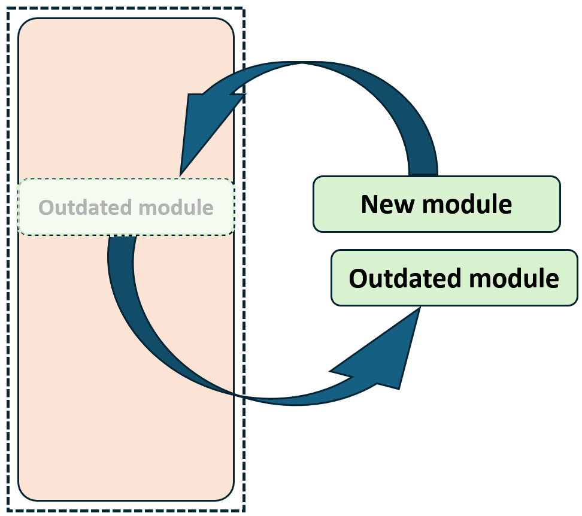

# pe-Evaluator: Automatic code grading script based on modular framework

[中文]() |

pe-Evaluator is an automated code grading framework based on the Python language, featuring an open modular framework. Among various automation frameworks, it uniquely incorporates an open modular approach to further enhance maintainability and flexibility. The design goal of pe-Evaluator is to be flexible, easy to use, and maintainable.

This is presented as my first practical exercise, and feedback or issues are welcome on GitHub.

* [**Documentation**](#documentation)
* [**Getting started**](#getting-started)
* [**Introduction to structure**](#introduction-to-structure)
* [**Customize your process**](#customize-your-process)


## <div align="center">👟Open modular framework</div>
<p ="center">
  
</p>


## <div align="center">📔Documentation</div>

See below for a quickstart and usage example

<details open>
<summary>Preliminaries</summary>

### Environment
This project is based on a [**Python>=3.10**](https://www.python.org/) environment with Windows 11 & Ubuntu 20.04.

### Package install
```bash
pip install numpy
pip install pandas
```

For alternative installation methods including [Conda](https://anaconda.org/conda-forge/pandas), and Git.

</details>

## <div align="center">👐Getting started</div>

<details open>
<summary>Usage</summary>

### CLI

pe-Evaluator may be used directly in the Command Line Interface (CLI) with a python command:

```bash
python main.py -config pe1.py -debug False
```

`-config` Description of the location of the file
`-debug` Description of running tasks

### Python

pe-Evaluator can also be used in a Python environment from within pe_Evaluator and accepts the same arguments as in the CLI example above:

```python
from src.core import main

if __name__ == '__main__':
    config = "setting/pe1.yaml" ##Description of the location of the file
    debug = False
    main(config, debug)    ##run script
```

</details>

## <div align="center">🔖Introduction to structure</div>

|                |                                                                       instruction                                                                       |
|:--------------:|:-------------------------------------------------------------------------------------------------------------------------------------------------------:|
|   Setup-step   |                                            Read YAML, construct the framework used and initialize variables                                             |
|  Exmaple-step  |                     Execute the template script. Extract information and construct a dictionary with the template script responses.                     |
| Evaluator-step |  Execute all content requiring grading within the file, and compare the extracted content against the template. Finally, produce the grading results.   |
|  Output-step   |                                              Summarize all experimental results and organize the findings.                                              |


## <div align="center">⚒️Architecture example</div>
<p = "center">
  
</p>

#### Here is the architecture example for `cfg/structure_default.yaml`.
You can build your own structure.yaml according to your requirements
✍️
## <div align="center">Customize your process</div>
<details open>
<summary>setting.yaml</summary>

### Create a setting yaml.

You need to customize your configuration file so that the script knows where your architecture files are, where to input and output, and the settings for execution.

|                   |                         example                         | definition                                                                               |
|:-----------------:|:-------------------------------------------------------:|:-----------------------------------------------------------------------------------------|
|        cfg        |                 cfg/structure_pe1.yaml                  | Architecture file PATH                                                                   |
|      timeout      |                            3                            | time-out time                                                                            |
|       mode        |                           mp                            | {mp:parallel, sigle:single-core} -(default single-core)                                  |
|      cpu_num      |                           -1                            | Number of cores called when setting parallel mode - (half the default number of threads) |
|     test_path     |            data/1122_H210301-PE1上傳區-20240314            | Requires scoring file PATH                                                               |
|   exmaple_path    |                 exmaple/exmaple_pe1.py                  | exmaple PATH                                                                             |
|  save_check_path  |                     check_file/pe1                      | abnormal file directory                                                                  | 
|   save_csv_path   |                 output/exmaple_pe1.csv                  | Rating .csv PATH                                                                         |
|     nan_value     |                         -99999                          | Missing values                                                                           |
|     least_col     |                           -1                            | Minimum number of columns                                                                |
|    file_format    |                           .py                           | Required file format                                                                     |
|    test_input     |            [[4.3], [5], [6.2], [7.2], [3.5]]            | Input data available for evaluate                                                        |
|     input_key     |                  [['richter','value']]                  | input key words dict              |
|    output_key     | ['richter', 'joules', 'tnt', ['lunches', 'nutritious']] | output key words dict             |
| output_offset_thr |                      [0, 15, 2, 5]                      | Output decision threshold         |
|     find_path     |                            -                            | glob - Search formula                                                                    |
|     re_format     |                            -                            | re format for value extraction                                                           |
</details>

<details open>
<summary>structure.yaml</summary>

### Create a structure yaml.

You need to customize your architecture file so that the script knows what structure it should build, along with some necessary initial values.

|                    |                          example                          | definition                        |
|:------------------:|:---------------------------------------------------------:|:----------------------------------|
|       setup        |                  - [-1, sp_info, []]...                   | Setup-step blueprint settings     |
|      exmaple       |          - [[-2, 0], ev_command_run, [True]]...           | Exmaple-step blueprint settings   |
|     evaluator      |          - [[-2, 0], ev_command_run, [False]]...          | Evaluator-step blueprint settings |
|       output       |                - [-2, ot_df_concat, []]...                | Output-step blueprint settings    |

#### blueprint-format

```angular2html
blueprint-format
- [from_idx, module, args] #idx
```

#### blueprint-idx

```angular2html
from_idx:
- -1: pass value
- -2: step input
- other: module idx
```

For existing modules, you can learn more by visiting the [[**Doc**]](assets%2FREADME.md).

</details>


