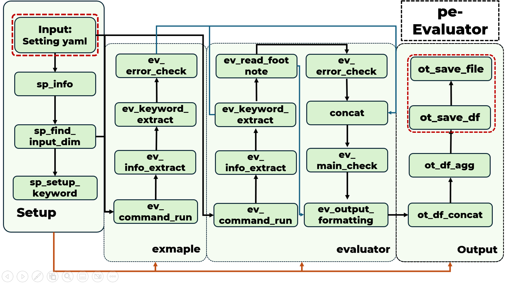

# pe-Evaluator: Automatic code grading script based on modular framework

[中文]() |

pe-Evaluator is an automated code grading framework based on the Python language, featuring an open modular framework. Among various automation frameworks, it uniquely incorporates an open modular approach to further enhance maintainability and flexibility. The design goal of pe-Evaluator is to be flexible, easy to use, and maintainable.

This is presented as my first practical exercise, and feedback or issues are welcome on GitHub.

<p ="center">
  
</p>

* [**updates**](#white_check_mark-updates)
* [**abstract**](#abstract)
* [**overview**](#overview--derivations)
* [**main results**](#main-results)
* [**getting started**](#getting-started)


## <div align="center">Documentation</div>

See below for a quickstart and usage example

<details open>
<summary>Preliminaries</summary>

### Environment
This project is based on a [**Python>=3.10**](https://www.python.org/) environment with Windows 11 & Ubuntu 20.04.

### Package install
```bash
pip install numpy
pip install pandas
```

For alternative installation methods including [Conda](https://anaconda.org/conda-forge/pandas), and Git.

</details>

<details open>
<summary>Usage</summary>

### CLI

pe-Evaluator may be used directly in the Command Line Interface (CLI) with a python command:

```bash
python main.py -c pe1.py
```

`-config` Description of the location of the file

### Python

pe-Evaluator can also be used in a Python environment from within pe_Evaluator and accepts the same arguments as in the CLI example above:

```python
from src.core import main

if __name__ == '__main__':
    config = "setting/pe1.yaml" ##Description of the location of the file
    main(config)    ##run script
```
python
</details>

### <div align="center">Introduction to structure</div>

|                |                                                                      ⭐instruction⭐                                                                        |
|:--------------:|:-----------------------------------------------------------------------------------------------------------------------------------------------------:|
|   Setup-step   |                                           Read YAML, construct the framework used and initialize variables                                            |
|  Exmaple-step  |                    Execute the template script. Extract information and construct a dictionary with the template script responses.                    |
| Evaluator-step | Execute all content requiring grading within the file, and compare the extracted content against the template. Finally, produce the grading results.  |
|  Output-step   |                                             Summarize all experimental results and organize the findings.                                             |


## <div align="center">Architecture example</div>
<p = "center">
  
</p>

#### Here is the architecture example for `cfg/structure_pe1` and `cfg/structure_pe1`.
You can build your own structure.yaml according to your requirements

## Customize your process

<details open>
<summary>setting.yaml</summary>

### Create a setting yaml.

You need to customize your configuration file so that the script knows where your architecture files are, where to input and output, and the settings for execution.

```yaml
##Basic profile
cfg:  #Architecture file PATH
timeout:   #ttime-out time

mode:     #{mp:parallel, sigle:single-core} -(default single-core)
cpu_num:    #Number of cores called when setting parallel mode - (half the default number of threads)

##Read and write settings
test_path:   #Requires scoring file PATH
exmaple_path:    #exmaple PATH

save_output_path:     #exmaple output PATH
save_check_path:  #abnormal file directory
save_csv_path:    #Rating .csv PATH

##Advanced settings
nan_value:  #Missing values
least_col:   #Minimum number of columns
file_format:   #Required file format

##Input setting
test_input:  #Input data available for evaluate

##Search formula
find_path: '/*/*' #glob - Search formula
re_format: (\d+\.\d+|\de\d+|\d+)\s* #re format for value extraction

```


